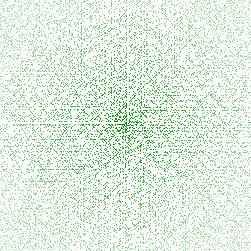

# Ulam Spiral
This is a very simple program to create images with an Ulam Spiral on it. 
The output of the program with a image dimension of 200 will be the following:

In this case the prime numbers are highlighted in green color. As you see, the mysterious (or maybe not so) diagonals are shown,
indicating that there could be a pattern in the prime number distribution.

If you don't know who is Stanislaw Ulam and what he discovered, or you want to know more about the 
Ulam Spiral, here are some links:

* [Ulam Spiral](http://en.wikipedia.org/wiki/Ulam_spiral)
* [Ulamspiral.com](http://ulamspiral.com/)
* [Prime Spiral](http://mathworld.wolfram.com/PrimeSpiral.html)

# Why?
Well, I like the kind of mystery around the prime numbers and I am liking a lot the Go programing language a lot, 
so I decided to start learning the image processing in Go with this tiny program.
 
If I find the time, I will try to play a little more with other kind of prime numbers graphical representations...

Who knows, maybe the formula to get Prime numbers is about to be discovered! (Well, in that case we should not 
be that happy. The Internet security would explode!)